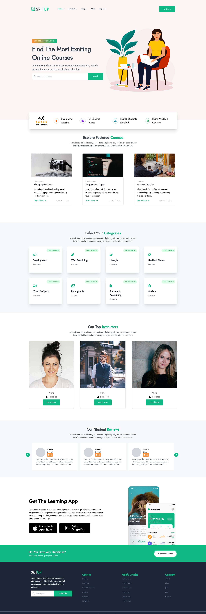

# Skill-Up-Landing-Page

Welcome to the landing page project! This page was built using HTML, CSS, and vanilla JavaScript, with Tailwind CSS as the styling framework and Vite as the build tool. It is hosted on Netlify.

## Getting Started

To run this project locally, follow these steps:

1. Clone or download the repository
2. Navigate to the project directory
3. Run `npm install` to install the necessary dependencies
4. Run `npm run dev` to start the development server
5. Open your browser and navigate to `http://localhost:3000` to view the page

## Deployment

This project is hosted on Netlify, using continuous deployment from the `master` branch. Any pushes to `master` will trigger a new build and deployment.

## Built With

- HTML
- CSS
- JavaScript
- [Tailwind CSS](https://tailwindcss.com/)
- [Vite](https://github.com/vitejs/vite)
- [Netlify](https://www.netlify.com/)

## Preview

## Contributing

If you would like to contribute to this project, please follow these guidelines:

1. Fork the repository
2. Create a new branch for your feature
3. Commit your changes and push to the new branch
4. Create a pull request from your branch to the `master` branch of this repository

Thank you for considering contributing to this project!
